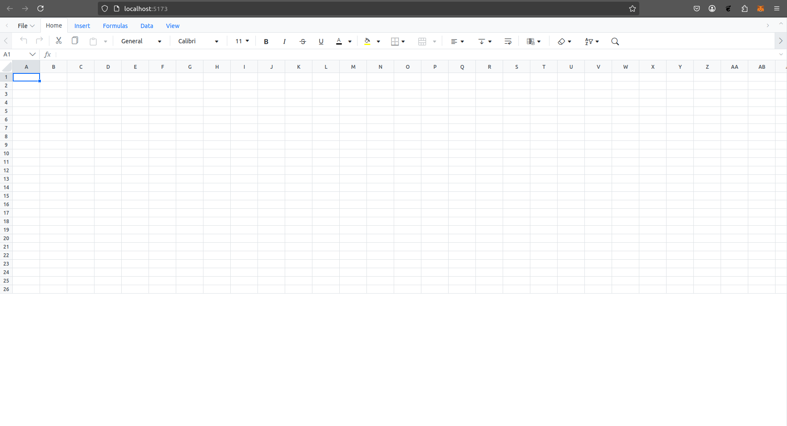

# Google Sheets Clone



## Overview

This project is a web-based spreadsheet application that closely mimics the user interface and core functionalities of Google Sheets. The focus is on providing mathematical and data quality functions, efficient data entry, and key UI interactions while maintaining a user-friendly experience.

## Features

### 1. Spreadsheet Interface

- **Google Sheets-like UI:** A familiar design with a toolbar, formula bar, and structured cells.
- **Drag Functions:** Drag and drop support for cell content, formulas, and selections.
- **Cell Dependencies:** Automatic updates of dependent cells when values change.
- **Basic Cell Formatting:** Support for bold, italics, font size, and color.
- **Row & Column Management:** Ability to add, delete, and resize rows and columns.

### 2. Mathematical Functions

Implemented functions include:

- `SUM(range)`: Calculates the sum of a range of cells.
- `AVERAGE(range)`: Computes the average value in a range.
- `MAX(range)`: Finds the maximum value in a range.
- `MIN(range)`: Finds the minimum value in a range.
- `COUNT(range)`: Counts the number of numerical values in a range.

### 3. Data Quality Functions

- `TRIM(cell)`: Removes leading and trailing whitespace.
- `UPPER(cell)`: Converts text to uppercase.
- `LOWER(cell)`: Converts text to lowercase.
- `REMOVE_DUPLICATES(range)`: Eliminates duplicate rows.
- `FIND_AND_REPLACE(range, find, replace)`: Allows users to search and replace text.

### 4. Data Entry and Validation

- **Data Type Support:** Users can input numbers, text, and dates.
- **Basic Validation:** Ensures that numeric cells contain only numbers.

### Bonus Features

- Additional mathematical and data quality functions.
- Support for relative and absolute cell references.
- Save and load spreadsheets.
- Data visualization features (charts, graphs).

## Tech Stack

### **Frontend:**

- **React.js**: Provides a modular and responsive UI.

## Getting Started

### Prerequisites

Ensure you have the following installed:

- Node.js (v20 or higher)

### Installation

1. Clone the repository:
   ```bash
   git clone https://github.com/Darkhood148/google-sheets-clone.git
   cd google-sheets-clone
   ```
2. Install dependencies:
   ```bash
   npm install
   ```
3. Start the development server:
   ```bash
   npm run dev
   ```
4. Open the application in your browser at `http://localhost:5173`.

